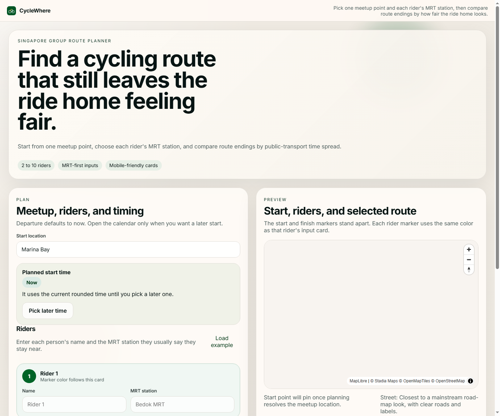

# CycleWhere

CycleWhere helps small groups in Singapore find a fair cycling route.

[Open the live app](https://cyclewhere.pages.dev)

## What It Does

CycleWhere starts from one meetup point, lets each rider pick the MRT or LRT station they stay near, and compares possible route endings by how fair the trip home looks for the whole group.

Instead of only asking "what is the nicest route?", it also asks:

- Which ending keeps the ride home reasonably balanced for everyone?
- Which route still looks legitimate for cycling, instead of forcing a messy or unrealistic path?
- Which options are worth opening in Google Maps for actual ride tracking?

## How It Works

- Riders enter MRT or LRT stations, not home addresses.
- The planner mixes trusted corridor routes with live route discovery.
- Fairness is ranked by the spread in journey-home times across the group.
- Real route geometry and cycling-quality signals help keep the selected routes believable.
- The chosen route can be opened directly in Google Maps.

## Live Stack

- Frontend: React, Vite, TypeScript, MapLibre
- Backend: Cloudflare Workers with Hono
- Data and cache: Cloudflare D1
- Routing and transit inputs: OneMap

## Deployment

- Live site: [cyclewhere.pages.dev](https://cyclewhere.pages.dev)
- Production API: [cyclewhere-api-production.cyclewhere.workers.dev](https://cyclewhere-api-production.cyclewhere.workers.dev/api/health)

## Notes

- OneMap credentials stay in Cloudflare Worker secrets and are not exposed to the frontend.
- MRT and LRT selection is designed for quick mobile input, with route planning blocked until every rider has a valid station.
- Local cache and temp artifacts are intentionally excluded from Git so they do not leak local machine details.
