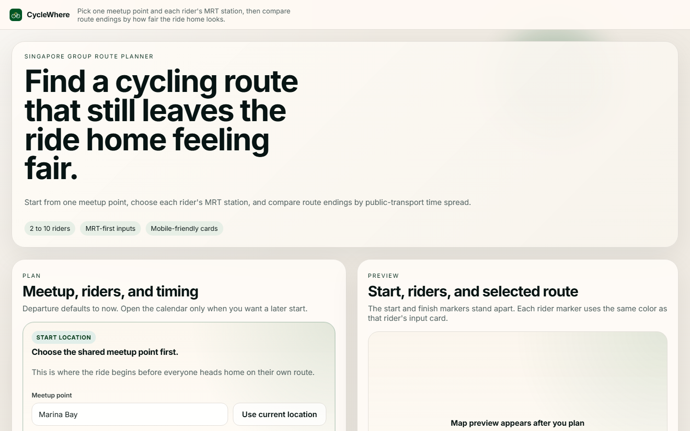
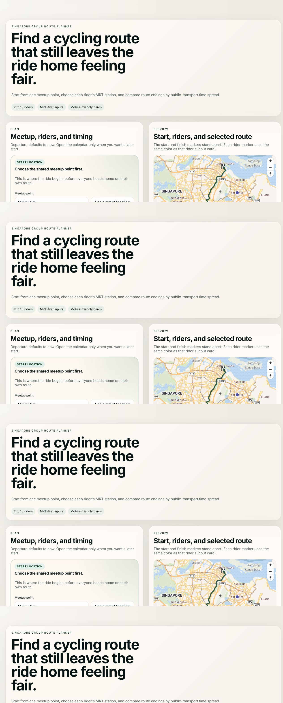

# CycleWhere

> **Project sunset:** CycleWhere is no longer operated as a live service. This repository is a public archive of the idea and user interface only.

CycleWhere explored a simple question for group rides in Singapore: **which cycling route ends somewhere that still leaves the journey home feeling fair for everyone?**

Riders would choose one meetup point and the MRT or LRT station each person lives near. The product would compare credible route endings against the group's onward public-transport journeys, making the trade-off between a good ride and a fair trip home visible.

## Product idea

- Plan for 2–10 riders without collecting anyone's home address.
- Use familiar MRT and LRT stations as lightweight home-area inputs.
- Compare route endings by the spread between each rider's onward journey.
- Show enough detail for the group to choose together, rather than presenting a mysterious single answer.
- Keep the experience practical on a phone at the start of a ride.

## UI gallery

| Route comparison | Mobile flow |
| --- | --- |
|  |  |

## What's in this repository

This is a deliberately frontend-only archive:

- `index.html`, `styles.css`, and `app.js` form a small static showcase.
- `assets/` contains selected final UI captures.
- There are no API clients, backend services, routing engines, databases, secrets, deployment workflows, or infrastructure configuration.

Open `index.html` directly in a browser to view the showcase. No build step or network service is required.

## Status

The project is archived and the live product should not be considered operational. The original private implementation is not part of this public repository.

## License

MIT
